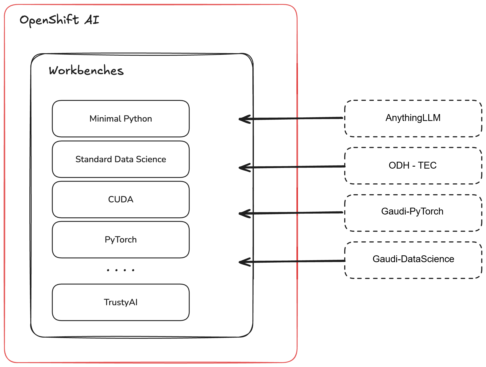

# Custom Workbench Images for Red Hat OpenShift AI

This repository was created by the CAI team.
This repository provides a fast way to add a collection of community-contributed Custom Workbench Images for Red Hat OpenShift AI (RHOAI), helping you get to work faster with specialized tools and libraries.

These images extend the functionality of your RHOAI environment with additional tools and capabilities that can be immediately accessed by all users.

They are not part of the core product, and therefore, do not fall under the support umbrella of OpenShift AI.


### Architecture



## Available Images

The following custom workbench images are available in this collection. For the full list of available images, see the [`imagestreams`](./imagestreams) directory.

### [AnythingLLM](./imagestreams/AnythingLLM-Custom-Workbench-Image.yaml)

- **Description**: A powerful chatbot frontend that easily connects to Large Language Models.
- **Key Features**:
  - OpenAI-compatible API integration
  - User-friendly chat interface
  - Customizable chat experience
- **Use Cases**:
  - Quickly build and deploy conversational AI applications
  - Test and iterate on different LLMs
  - Create interactive demos and prototypes
- **GitHub Repository**: [llm-on-openshift/anythingllm](https://github.com/rh-aiservices-bu/llm-on-openshift/tree/main/llm-clients/anythingllm)

### [ODH-TEC](./imagestreams/ODH-TEC-Custom-Workbench-Image.yaml)

- **Description**: An enhanced data science workbench with integrated S3 capabilities for seamless data access.
- **Key Features**:
  - Web-based S3 browser
  - Integrated data science tools
  - Streamlined data access
- **GitHub Repository**: [odh-tec](https://github.com/opendatahub-io-contrib/odh-tec)

### [Gaudi-PyTorch](./imagestreams/Gaudi-PyTorch-Workbench-Image.yaml)

- **Description**: A minimal workbench with Habana drivers and Gaudi PyTorch modules
- **Key Features**:
  - Installed PyTorch with tools dedicated to Gaudi
  - Jupyter Notebook as user interface
  - Built on top of jupyter-minimal-ubi9-python-3.12 workbench from OpenDataHub
  - Communication with Gaudi through [Intel Gaudi Operator](https://catalog.redhat.com/en/software/container-stacks/detail/6683b2cce45daa25e36bddcb) (**prior installation required**)
- **GitHub Repository**: [HabanaAI/Setup_and_Install](https://github.com/HabanaAI/Setup_and_Install)

### [Gaudi-DataScience](./imagestreams/Gaudi-DataScience-Workbench-Image.yaml)

- **Description**: An enhanced workbench for Gaudi with integrated data sciance tools
- **Key Features**:
  - Similar to Gaudi-PyTorch, but with data science tools
  - Built on top of jupyter-datascience-ubi9-python workbench from OpenDataHub
  - Requires Intel Gaudi Operator installed
- **GitHub Repository**: [HabanaAI/Setup_and_Install](https://github.com/HabanaAI/Setup_and_Install)

## Getting Started

Follow these steps to install and use the custom workbench images in your Red Hat OpenShift AI environment. For detailed installation instructions, see the documentation in the [`imagestreams`](./imagestreams) directory.

### Prerequisites

Before you begin, ensure you have the following:

- Red Hat OpenShift cluster with administrator access
- Red Hat OpenShift AI (RHOAI) installed and configured
- `oc` CLI tool installed and logged in with cluster-admin privileges

### Installation

You can install all images at once or individually from the [`imagestreams`](./imagestreams) directory based on your needs. Keep in mind that images that were build in [`dockerfiles`](./dockerfiles) directory have to be pushed after applying ImageStreams (Gaudi-PyTorch and Gaudi-DataScience).

#### Install All Images

To install all available custom workbench images, run the following command:

```bash
# Apply all custom workbench images
oc apply -k https://github.com/rh-ai-kickstart/custom-workbench-images-examples/imagestreams/
```

#### Install Individual Images from public registry

To install a specific image, use the appropriate command below:

```bash
# Set the base URL for individual image streams
URL='https://raw.githubusercontent.com/rh-ai-kickstart/custom-workbench-images-examples/main/imagestreams'

# Install AnythingLLM
oc apply -f ${URL}/AnythingLLM-Custom-Workbench-Image.yaml

# Install ODH-TEC
oc apply -f ${URL}/ODH-TEC-Custom-Workbench-Image.yaml
```

#### Install Individual Images built locally

To install images built locally, follow the instructions below:

```bash
# Enable route and login to the registry
oc patch configs.imageregistry.operator.openshift.io/cluster --type=merge -p '{"spec":{"defaultRoute":true}}'
REGISTRY=$(oc get route -n openshift-image-registry default-route -o jsonpath='{.spec.host}')
docker login -u kubeadmin -p $(oc whoami -t) $REGISTRY

# Install Gaudi-PyTorch
docker tag pytorch-installer-rhel9.6.rhoai.pytorch-2.7.1:1.22.1-6 $REGISTRY/redhat-ods-applications/ai-quickstart-image-gaudi-pytorch:1.22.1-6
oc apply -f imagestreams/Gaudi-PyTorch-Workbench-Image.yaml
docker push $REGISTRY/redhat-ods-applications/ai-quickstart-image-gaudi-pytorch:1.22.1-6

# Install Gaudi-DataScience
docker tag pytorch-installer-rhel9.6.rhoai.datascience-2.7.1:1.22.1-6 $REGISTRY/redhat-ods-applications/ai-quickstart-image-gaudi-datascience:1.22.1-6
oc apply -f imagestreams/Gaudi-DataScience-Workbench-Image.yaml
docker push $REGISTRY/redhat-ods-applications/ai-quickstart-image-gaudi-datascience:1.22.1-6
```


## Usage

After installation, the new images will be available in the RHOAI dashboard. Users can select them when creating or configuring workbenches, just as they would with the default images.

### Uninstallation

To remove all custom workbench images added by this repository, run the following command:

```bash
oc delete -k https://github.com/rh-ai-kickstart/custom-workbench-images-examples/imagestreams/
```

## Community

### Contributing

We welcome contributions to expand this collection of custom workbench images. If you have an image that would be useful to the community, please open a pull request with your proposed changes.

### Support

These images are provided by the community and are not officially supported by Red Hat. They are provided as-is, and while we strive for quality, there is no guarantee of support. If you encounter issues, please check the respective GitHub repositories or open an issue in this repository. 


### Categories

This project falls into the following categories:

- AI
- Workbench Images
- RHOAI
- OpenShift

### Tags

- custom-workbench
- oc-apply
